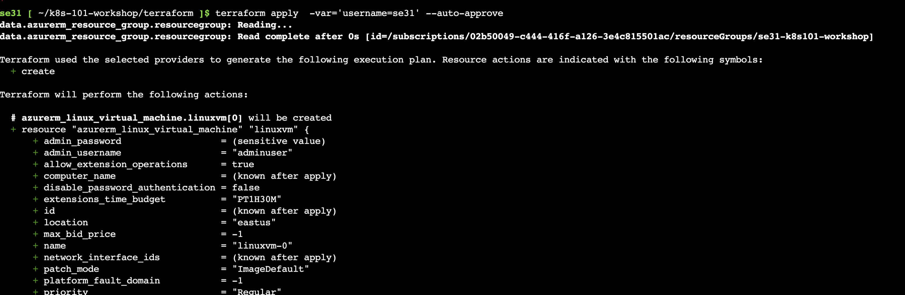
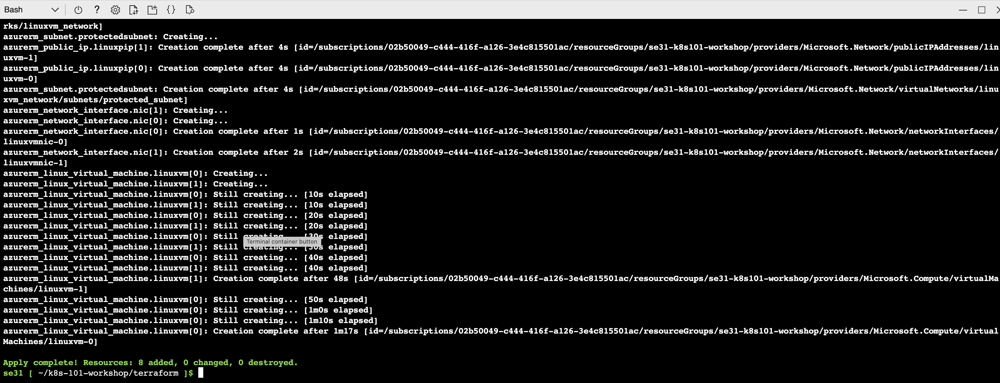

### Task 2 - Launch resources using Terraform

All the components required for Lab are deployed through terraform. 

Here is the Architecture diagram for Lab1: 


Perform the following steps in your Cloudshell console to create your environment.

1. Clone the Github repo `git clone https://github.com/FortinetCloudCSE/k8s-101-workshop.git`
2. Change directory to the `cd k8s-101-workshop/terraform` folder
3. Run `terraform init`

```sh
git clone https://github.com/FortinetCloudCSE/k8s-101-workshop.git
cd k8s-101-workshop/terraform
terraform init
```


4. Set the Terraform environment variables **(check in dedicated the e-mail send to you by the organizers)**:
    
5. Run `terraform apply  -var='username=userXX' --auto-approve` or `terraform apply -var="username=$(whoami)" --auto-approve` to apply it

    Your username can be found in the login email.  
    Say your Azure account login is se31@ftntxxxxx.onmicrosoft.com, your username is **se31** 

```sh
terraform apply  -var='username=UserXX' --auto-approve
```


    
6. Terraform deployment takes atleast 10-15 min to complete.



7. Once Terraform is complete you should see the output. Please copy the output to notepad.

    (will add picture here)

8. To print the node VM's login password, you can run this command ```terraform output -raw linuxvm_password```

    (will add picture here)
