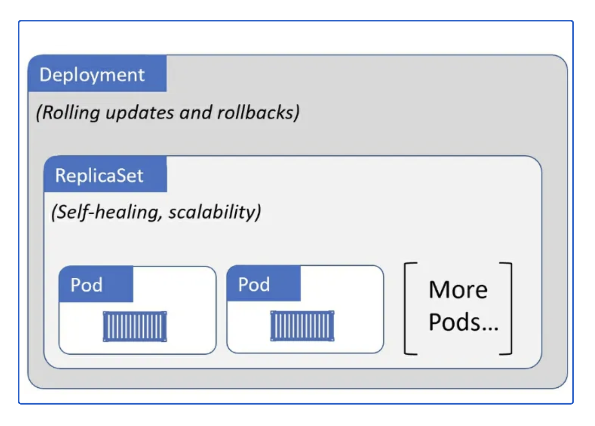

In this chapter, we delve into Kubernetes fundamentals using a managed AKS cluster. You're set to begin right from the Azure Shell, leveraging the az aks command to streamline cluster setup without navigating through complex installation steps. Our focus areas include **Pods**, **Labels**, **Deployments**, **Replicas**, and **Namespaces**.


### Quick AKS Cluster Setup

#### **Task : Create AKS Cluster**

We'll kick off by deploying a managed AKS cluster featuring a single worker node. This hands-on approach introduces you to Kubernetes essentials efficiently, with the setup process completing in about 5 minutes."

In your **Azure Cloud Shell**, click the 'copy to clipboard' icon at the top right corner to copy the command. Then, paste it into the terminal and press enter to execute.

Below script will creaet a managed azure K8s (AKS) with one worker node, also update kubeconfig for access AKS.

```bash
##generate public key if not exist 
[ ! -f ~/.ssh/id_rsa ] && ssh-keygen -q -N "" -f ~/.ssh/id_rsa
clustername=$(whoami)

##get the resourcegrname name 
resourcegroupname=$(az group list --tag FortiLab="k8s101-lab" | jq -r .[].name)
az aks create \
    --name ${clustername} \
    --node-count 1 \
    --vm-set-type VirtualMachineScaleSets \
    --network-plugin azure \
    --service-cidr  10.96.0.0/16 \
    --dns-service-ip 10.96.0.10 \
    --nodepool-name worker \
    --resource-group $resourcegroupname

##update kubeconfig file for kubectl to use 
az aks get-credentials -g  $resourcegroupname -n ${clustername} --overwrite-existing
```

Verify provisioned AKS cluster with
```bash
az aks list --resource-group $resourcegroupname --output table
```
expected output:

```
[Warning] This output may compromise security by showing the following secrets: ssh, linuxProfile, keyData, publicKeys. Learn more at: https://go.microsoft.com/fwlink/?linkid=2258669
Name    Location    ResourceGroup          KubernetesVersion    CurrentKubernetesVersion    ProvisioningState    Fqdn
------  ----------  ---------------------  -------------------  --------------------------  -------------------  -----------------------------------------------------------
k8s50   eastus      k8s50-k8s101-workshop  1.27                 1.27.9                      Succeeded            k8s50-k8s50-k8s101-wor-02b500-eg9yx3nt.hcp.eastus.azmk8s.io
```


### Operate Kubernetes objects

There are two primary methods for managing Kubernetes objects:

- Imperative Management: This approach uses direct kubectl commands to create, update, and delete Kubernetes resources. It's beneficial for ad-hoc development and experimentation due to its straightforward syntax. However, it might not fully leverage all Kubernetes API features and is less suited for tracking changes in version control.

- Declarative Management: This method involves defining resources in YAML or JSON manifests and managing them with commands like kubectl apply. It's ideal for production environments and version-controlled configuration, offering reproducibility and easier management of complex deployments.

While imperative commands offer a quick way to perform tasks and are excellent for learning Kubernetes, declarative management provides a more robust framework for consistent and reproducible infrastructure management.

In this task, we will explore the imperative approach using kubectl to familiarize ourselves with basic Kubernetes operations.


### Use Kubectl 

Once you have a running Kubernetes cluster, you can deploy your containerized applications on top of it. To do this,  we use the `kubectl` command to create Pod , deployments or other objects in Kubernetes. 

kubectl relies on a configuration file found at ~/.kube/config for authentication and communication with the kube-api-server. Running `kubectl config view` displays details about the kube-API server, including its address, name, and the client's key and certificate.

*To use kubectl from your personal client machine, you need to copy the ~/.kube/config file from the server to your client machine. Additionally, ensure your client machine can connect to the kube-API server's address.*  


#### **Task: Download Kubectl**

Download the kubectl version that is compatible with your Kubernetes server version.

```bash
curl -Lo $HOME/kubectl https://dl.k8s.io/release/v1.27.2/bin/linux/amd64/kubectl && chmod +x $HOME/kubectl && export PATH=$HOME:$PATH
```


- basic usage of kubectl

The common format of a kubectl command is: **kubectl _ACTION RESOURCE_**

This performs the specified action (like create, describe or delete) on the specified resource (like node or deployment). You can use --help after the subcommand to get additional info about possible parameters (for example: kubectl get nodes --help).

Check that kubectl is configured to talk to your cluster, by running the `kubectl version` command.

Check that kubectl is installed and you can see both the client and the server versions.

- Most used kubectl commands: 

```
Basic Commands (Beginner):
  create          Create a resource from a file or from stdin
  expose          Take a replication controller, service, deployment or pod and expose it as a new Kubernetes service
  run             Run a particular image on the cluster
  set             Set specific features on objects

Basic Commands (Intermediate):
  explain         Get documentation for a resource
  get             Display one or many resources
  edit            Edit a resource on the server
  delete          Delete resources by file names, stdin, resources and names, or by resources and label selector

Deploy Commands:
  rollout         Manage the rollout of a resource
  scale           Set a new size for a deployment, replica set, or replication controller
  autoscale       Auto-scale a deployment, replica set, stateful set, or replication controller
  ```
for example, you can use `kubectl get node` or `kubectl get node -o wide` to check cluster node detail

 

```bash
kubectl get node
```

*If you're using self-managed Kubernetes, you'll see both master and worker nodes in your cluster. However, with managed Kubernetes services like AKS, only worker nodes are visible. Kubernetes will deploy our application based on the available worker nodes.*

expected outcome on AKS cluster
```
NAME                             STATUS   ROLES   AGE     VERSION
aks-worker-20494901-vmss000000   Ready    agent   2m56s   v1.27.9
```

### Summary

Above, we set up an AKS cluster with a single worker node and downloaded kubectl to interact with the AKS API server. Now let's learn basic Kubernetes concept.

### Pod

**What is a Pod?**

A Pod in Kubernetes is like a single instance of an application. It can hold closely related containers that work together. All containers in a Pod share the same IP address and ports, and they are always placed together on the same server (Node) in the cluster. This setup means they can easily communicate with each other.  Pods provide the environment in which containers run and offer a way to logically group containers together. 

To create a Pod:

- kubectl run: Quick way to create a single Pod for ad-hoc tasks or debugging.
- kubectl create: Creates specific Kubernetes resources with more control. Use kubectl create -f to create from file. 
- kubectl apply: Creates or updates resources based on their configuration files. Use kubectl apply -f to create from file. 

#### **Task: Create and Delete Pod**

1. use `kubectl run` to create Pod

2. Create a Pod with `kubectl run`


```bash
kubectl run juiceshop --image=bkimminich/juice-shop
``` 
above will create a Pod with container juiceshop runing inside it. 

use `kubectl get pod` to check the Pod
```bash
kubectl get pod
```
**expected result**
```
kubectl get pod
NAME        READY   STATUS    RESTARTS   AGE
juiceshop   1/1     Running   0          7s
```
You might see the **STATUS** of Pod is **ContainerCreating** , but eventually, it will become "Running".

use `kubectl logs po/juiceshop` to check the terminal log from Pod. you are expected see logs like **info: Server listening on port 3000** 


3. delete the Pod with `kubectl delete`. check Pod again with `kubectl get pod`


```bash
kubectl logs po/juiceshop
```
expected result
```
info: All dependencies in ./package.json are satisfied (OK)
info: Detected Node.js version v20.10.0 (OK)
info: Detected OS linux (OK)
info: Detected CPU x64 (OK)
info: Configuration default validated (OK)
info: Entity models 19 of 19 are initialized (OK)
info: Required file server.js is present (OK)
info: Required file index.html is present (OK)
info: Required file styles.css is present (OK)
info: Required file polyfills.js is present (OK)
info: Required file main.js is present (OK)
info: Required file runtime.js is present (OK)
info: Required file vendor.js is present (OK)
info: Port 3000 is available (OK)
info: Domain https://www.alchemy.com/ is reachable (OK)
info: Chatbot training data botDefaultTrainingData.json validated (OK)
info: Server listening on port 3000
```

- Create Pod from yamlfile

Create Pod with `kubectl create -f <yamlfile>` or `kubectl apply -f <yamlfile>

```bash
cat << EOF | tee juice-shop2.yaml
apiVersion: v1
kind: Pod
metadata:
  name: juiceshop2
  labels:
    run: juiceshop2
spec:
  containers:
  - image: bkimminich/juice-shop
    name: juiceshop
EOF
kubectl create -f juice-shop2.yaml
```
`cat << EOF` is a shell syntax for a "here document" (heredoc). It allows you to provide a block of input text directly in the shell. The input continues until the token EOF (End Of File) is encountered again in the input stream.
``|`` is the pipe operator, which takes the output of the command on its left (the heredoc in this case) and uses it as the input for the command on its right. In the next following chapters, we are going to use this a lot.

check result with `kubectl get pod`

```bash
kubectl get pod
```
expected result

you shall see two Pod is running
```
NAME         READY   STATUS    RESTARTS   AGE
juiceshop   1/1     Running   0          84s
juiceshop2   1/1     Running   0          20s
```
- delete Pod

use `kubectl delete` to delete the Pod 

```bash
kubectl delete pod juiceshop2
```
expected result
you shall see juiceshop2 now deleted

```
NAME        READY   STATUS    RESTARTS   AGE
juiceshop   1/1     Running   0          63s
```

### Labels

Labels in Kubernetes are key/value pairs attached to objects, such as Pods, Services, and Deployments. They serve to organize, select, and group objects in ways meaningful to users, allowing the mapping of organizational structures onto system objects in a loosely coupled fashion without necessitating clients to store these mappings.

1. Labels can be utilized to filter resources when using kubectl commands. For example, executing the command below will retrieves all Pods labeled with run=juiceshop.

```bash
kubectl get pods -l run=juiceshop
```

2. Labels can be added to an object using the `kubectl label` command. For instance, executing below will add the key:value pair "purpose=debug" to the Pod named juiceshop.

```bash
kubectl label pod juiceshop purpose=debug
```

3. To display all the labels:

```bash
kubectl get pod --show-labels
``` 
Expected Output 

```
NAME                  READY   UP-TO-DATE   AVAILABLE   AGE   LABELS
juiceshop   1/1     Running   0          4m7s   purpose=debug,run=juiceshop
```


### What is a kubernetes Deployment 

While directly creating Pods might be suitable for learning purposes or specific use cases (like one-off debugging tasks), **deployments** offer a robust and scalable way to manage containerized applications in production environments. Deployments abstract away much of the complexity associated with Pod management, providing essential features such as automatic scaling, self-healing, rolling updates, and rollbacks, which are critical for running reliable and available applications in Kubernetes.



- Deployment in Kubernetes manages app Pods, ensuring they run and update smoothly.
- Simplifies app management and scaling by handling Pods replication and updates.
- Using kubectl, you can scale Pods easily (e.g., from 1 to 10) to meet demand.
- Monitors app Pods continuously for any failures.
- Implements self-healing by replacing failed Pod on other nodes in the cluster.

#### **Task:  Deploying an Application with Deployment**

1. Deploy your first application on Kubernetes using the `kubectl create deployment` command. This is an imperative command.It requires specifying the deployment name and the location of the application image (including the full repository URL for images not hosted on Docker Hub).

2. Deployment kubernetes-bootcamp application

```bash
kubectl create deployment kubernetes-bootcamp --image=gcr.io/google-samples/kubernetes-bootcamp:v1
```

the **--image** choose the container image to use for Pod. Above we use image from image repository gcr.io , if you prefer to use juice-shop from docker' , you can use `kubectl create deployment juiceshop --image=docker.io/bkimminich/juice-shop`. as Docker Hub is the default registry. you could also use `kubectl create deployment juiceshop --image=bkimminich/juice-shop` instead.


Congratulations! You've just deployed your first application by creating a deployment. 

The `kubectl create deployment` command is used to create a new deployment in Kubernetes. Deployments manage a set of replicas of your application, ensuring that a specified number of instances (Pods) are running at any given time. This command specifically:

Name: Specifies the name of the deployment, in this case, kubernetes-bootcamp.
Image: Determines the container image to use for the Pods managed by this deployment, here gcr.io/google-samples/kubernetes-bootcamp:v1, which is a sample application provided by Google.
By executing this command, you instruct Kubernetes to pull the specified container image, create a Pod for it, and manage its lifecycle based on the deployment's configuration. This process encapsulates the application in a scalable and manageable unit, facilitating easy updates, rollbacks, and scaling."

3. To view your deployments use the kubectl get deployments command:

```bash
kubectl get deployment -l app=kubernetes-bootcamp
```
We see that there is 1 deployment running a single Pod of your app. Container(s) is running inside a Pod with shared storage and IP.

expected outcome

```
NAME                  READY   UP-TO-DATE   AVAILABLE   AGE
kubernetes-bootcamp   1/1     1            1           20m
```

In this output:

**kubernetes-bootcamp** is the name of the deployment managing your application.
**READY 1/1** indicates that there is one **Pod** targeted by the deployment, and it is ready.   1/1 mean's the deployment expect 1 Pod  and Pod in ready status is also 1 which mean the actual deployed Pod meet the expected number (**replica**).  **UP-TO-DATE**: Indicates the number of replicas that have been updated to achieve the desired state. 1 suggests that one replica is up-to-date with the desired configuration.**AVAILABLE**: Shows the number of replicas that are available to serve requests. 1 means there is one replica available. 

let's keep this deployment to explore what is **ReplicaSet** 

### What is ReplicaSet 

A **ReplicaSet** is a Kubernetes resource that ensures a specified number of replicas of a Pod are running at any given time. It is one of the key controllers used for Pod replication and management, offering both scalability and fault tolerance for applications. The primary purpose of a ReplicaSet is to maintain a stable set of replica Pods running at any given time. As such, it is often used to guarantee the availability of a specified number of identical Pods. **Deployment** is a higher-level resource in Kubernetes that actually manages ReplicaSets and provides declarative updates to applications. 

1. use below command to check the ReplicaSet (rs) that created when using Deployment to scale the application.

```bash
kubectl get rs -l app=kubernetes-bootcamp
kubectl describe rs kubernetes-bootcamp
```

2. from the output , we can find a line saying "Controlled By:  Deployment/kubernetes-bootcamp" with cli command 
```bash
kubectl describe rs kubernetes-bootcamp
```

expected output
```
NAME                             DESIRED   CURRENT   READY   AGE
kubernetes-bootcamp-5485cc6795   1         1         1       18m
Name:           kubernetes-bootcamp-5485cc6795
Namespace:      default
Selector:       app=kubernetes-bootcamp,pod-template-hash=5485cc6795
Labels:         app=kubernetes-bootcamp
                pod-template-hash=5485cc6795
Annotations:    deployment.kubernetes.io/desired-replicas: 1
                deployment.kubernetes.io/max-replicas: 2
                deployment.kubernetes.io/revision: 1
Controlled By:  Deployment/kubernetes-bootcamp
Replicas:       1 current / 1 desired
Pods Status:    1 Running / 0 Waiting / 0 Succeeded / 0 Failed
Pod Template:
  Labels:  app=kubernetes-bootcamp
           pod-template-hash=5485cc6795
  Containers:
   kubernetes-bootcamp:
    Image:        gcr.io/google-samples/kubernetes-bootcamp:v1
    Port:         <none>
    Host Port:    <none>
    Environment:  <none>
    Mounts:       <none>
  Volumes:        <none>
Events:
  Type    Reason            Age   From                   Message
  ----    ------            ----  ----                   -------
  Normal  SuccessfulCreate  18m   replicaset-controller  Created pod: kubernetes-bootcamp-5485cc6795-cdwz7
```

### Manage your Deployment 

#### **Task: Scale you Application**

1. scale out deployment

To manually scale your deployment with more replicas 

```bash
kubectl scale deployment kubernetes-bootcamp --replicas=10
```
2. Verify new deployment

```bash
kubectl get deployment kubernetes-bootcamp
```
expected output
```
NAME                  READY   UP-TO-DATE   AVAILABLE   AGE
kubernetes-bootcamp   10/10   10           10          26m
```

The **READY** status will eventually show 10/10, indicating that 10 replicas were expected and all 10 are now available."

We can use `kubectl get pod` to list the pod, use `-l` to select which pod to list.
**app=kubernetes-bootcamp** is the label assigned to pod during creating.
the expected pod will become 10. 

```bash
kubectl get pod -l app=kubernetes-bootcamp
```

3. scale in deployment

To reduce resource usage by scaling in the deployment, modify the --replicas parameter to 1, decreasing the expected number of Pods:

```bash
kubectl scale deployment kubernetes-bootcamp --replicas=1
```
### Explore the Pod deployed by Deployment 

```bash
kubectl get pod -l app=kubernetes-bootcamp -o wide
```
expected output 

You will observe some Pods in the **Terminating** state, and eventually, only 1 Pod will remain active.

```
NAME                                  READY   STATUS    RESTARTS   AGE   IP              NODE         
kubernetes-bootcamp-bcbb7fc75-5r649   1/1     Running   0          73s   10.244.222.16   worker001    
```

Above output is from the kubectl get Pod -o wide -l app=kubernetes-bootcamp command, which requests Kubernetes to list Pods with additional information (wide output) that match the label app=kubernetes-bootcamp. Here's a breakdown of the output:

**NAME**: kubernetes-bootcamp-bcbb7fc75-5r649 - This is the name of the Pod. Kubernetes generates Pod names automatically based on the deployment name and a unique identifier to ensure each Pod within a namespace has a unique name. you might noticed the name has some appended some hash value bcbb7fc75-5r649, this is created by **deployment** automatically for each replica. the Pod created with `kubectl run pod` or `kubectl create -f <pod.yaml>` does not have this hash appended in Pod name.


**READY**: 1/1 - This indicates the readiness state of the Pod. It means that 1 out of 1 container within the Pod is ready. Readiness is determined by readiness probes, which are used to know when a container is ready to start accepting traffic.

**STATUS**: Running - This status indicates that the Pod is currently running without issues.

**RESTARTS**: 0 - This shows the number of times the containers within the Pod have been restarted. A restart usually occurs if the container exits with an error or is killed for some other reason. In this case, 0 restarts indicate that the Pod has been stable since its creation. if Pod crashed for some reason, kube-manager will resatrt it. then the Rstart will change.

**AGE**: 73s - This shows how long the Pod has been running. In this case, the Pod has been up for 73 seconds.

**IP**: 10.244.222.16 - This is the internal IP address assigned to the Pod within the Kubernetes cluster network. This IP is used for communication between Pods within the cluster.

**NODE**: worker001 - This indicates the name of the node (physical or virtual machine) within the Kubernetes cluster on which this Pod is running. The scheduler decides the placement of Pods based on various factors like resources, affinity/anti-affinity rules, etc. In this case, the Pod is running on a node named worker001.
Below diagram show a Pod can have 1 container or multiple container, with or without shared storage. 

all the containers within a single Pod in Kubernetes follow  "shared fate" principle. This means that containers in a Pod are scheduled on the same node (physical or virtual machine) and share the same lifecycle, network namespace, IP address, and storage volumes. 


### Namespace

A namespace in Kubernetes is like a folder that helps you organize and separate your cluster's resources (like applications, services, and Pods) into distinct groups. It's useful for managing different projects, environments (such as development, staging, and production), or teams within the same Kubernetes cluster. Namespaces help avoid conflicts between names and make it easier to apply policies, limits, and permissions on a per-group basis

1. Understand the default namespace
By default, a Kubernetes cluster will instantiate a default namespace when provisioning the cluster to hold the default set of Pods, Services, and Deployments used by the cluster.

`kubectl get deployment kubernetes-bootcamp -n default` is same as `kubectl get deployment kubernetes-bootcamp`.

2. we can use `kubectl create namespace` to create different namespace name. use `kubectl get namespace` to list all namespaces in cluster.

3. Let's imagine a scenario where an organization is using a shared Kubernetes cluster for development and production use cases.

The development team would like to maintain a space in the cluster where they can get a view on the list of Pods, Services, and Deployments they use to build and run their application. In this space, Kubernetes resources come and go, and the restrictions on who can or cannot modify resources are relaxed to enable agile development.

The operations team would like to maintain a space in the cluster where they can enforce strict procedures on who can or cannot manipulate the set of Pods, Services, and Deployments that run the production site.

One pattern this organization could follow is to partition the Kubernetes cluster into two namespaces: development and production.

#### **Task: Create deployment in namespace** 

Follow the steps below to explore how namespaces organize your deployments in Kubernetes. Execute each command sequentially: 

- Create namespace:

```bash
kubectl create namespace production
kubectl create namespace development
```
- Verify the namespace creation:
```bash
kubectl get namespace production
kubectl get namespace development
```
- Deploy an application into namespace:
```bash
kubectl create deployment kubernetes-bootcamp --image=gcr.io/google-samples/kubernetes-bootcamp:v1 --namespace=production

kubectl create deployment kubernetes-bootcamp --image=gcr.io/google-samples/kubernetes-bootcamp:v1 --namespace=development

```

- Monitor the deployment's progress:
```bash
kubectl rollout status deployment kubernetes-bootcamp -n development
kubectl rollout status deployment kubernetes-bootcamp -n production
```

- Check the deployment details: 
```bash
kubectl get deployment kubernetes-bootcamp -n development
kubectl get deployment kubernetes-bootcamp -n production
kubectl get pod --namespace=production 
kubectl get pod -n=development
```
or use `kubectl get all -n=production` and `kubectl get all -n=development` to list everything in that namespace.


 - Delete namespace and everything inside it

it will take a while to delete namespace. Do not interupt it.

```bash
kubectl delete namespace production
kubectl delete namespace development
```

### Review Questions

1. Explain the role of a Deployment in Kubernetes. How does it simplify the process of scaling and managing application within the cluster?

2. How do namespaces contribute to resource management and isolation in a Kubernetes cluster? Provide an example scenario where separating resources into different namespaces would be beneficial.

3. Describe how containers are organized within a Pod in Kubernetes and explain the advantages of this arrangement for container communication and resource sharing.

