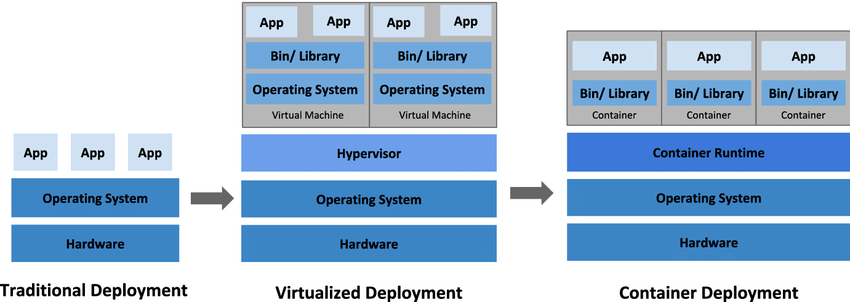

### Welcome to K8s 101 workshop

## About Kubernetes

Kubernetes is an open-source container orchestration platform that automates the deployment, scaling, and management of containerized applications. Originally developed by Google and now maintained by the Cloud Native Computing Foundation (CNCF), Kubernetes has become the de facto standard for managing containerized workloads in production environments.

## Workshop Objectives

In this workshop, you will:

- Build a kubernetes cluster by yourself.
- Gain a fundamental understanding of Kubernetes concepts.
- Learn how to deploy, manage, and scale applications using Kubernetes.
- Explore key Kubernetes resources such as Pods, Deployments, Services, and more.
- Gain hands-on experience with practical examples.

## Why building a cluster from scratch instead of using Managed Services like AKS,EKS?

- Building a cluster instead of relying on managed services for learning Kubernetes offers beginners hands-on experience, deeper understanding of core concepts, and greater control over configurations. 

- Building a cluster offers learners deepe understanding of core Kubernetes components such as pods, nodes, and controllers.

- In production environments, many organizations use managed Kubernetes services provided by major cloud providers. 

- These services, such as Amazon Elastic Kubernetes Service (EKS), Azure Kubernetes Service (AKS), and Google Kubernetes Engine (GKE), offer features like automated updates, scaling, monitoring, and integration with other cloud services.

- However, the choice often depends on factors such as existing cloud provider relationships, specific feature requirements, pricing, and the level of control and customization desired by the organization.